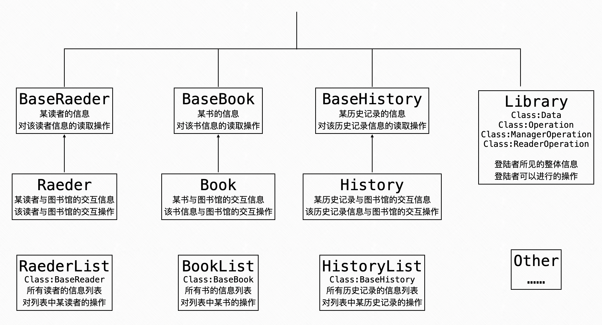
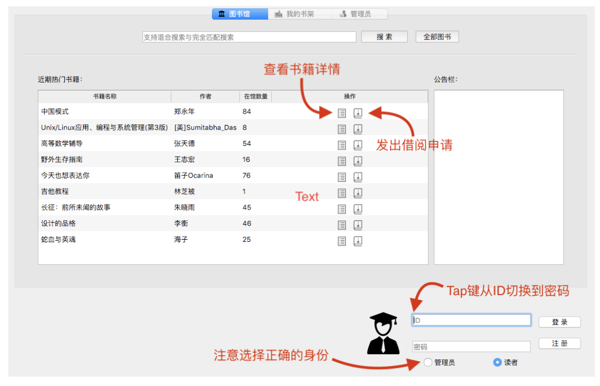
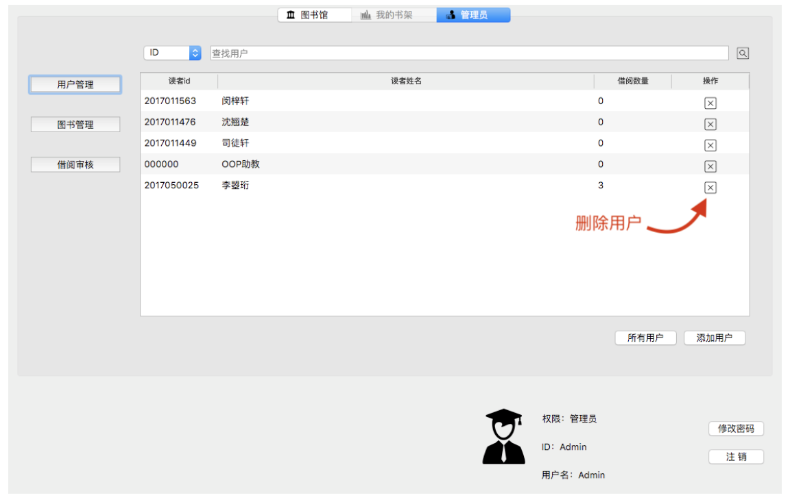
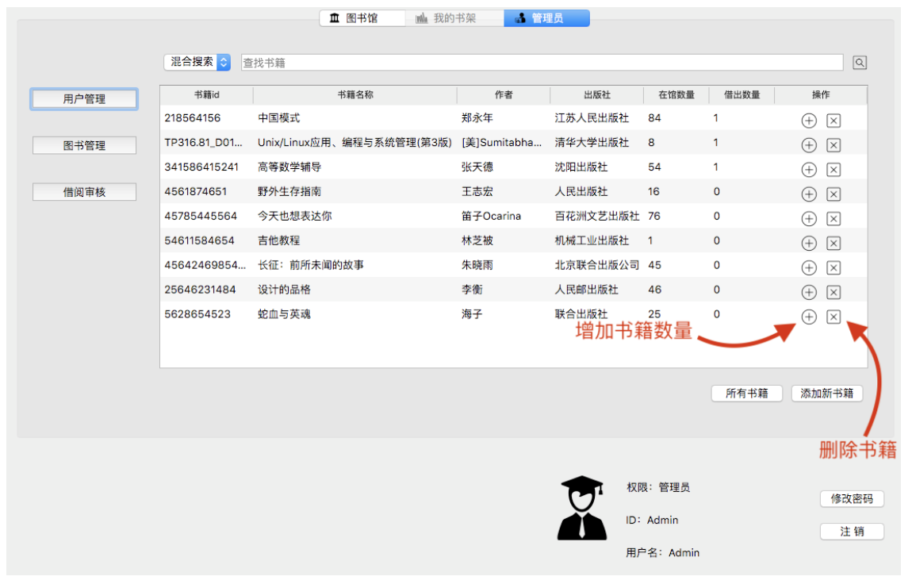

# 图书管理系统
清华大学计算机科学与技术系面向对象程序设计基础课程项目

## 项目内容及完成情况

图书管理系统。
实现了要求的所有基本功能，并进一步实现了图形界面。

## 代码结构说明

### 主题源代码说明 对应文件夹为`src-main`
主体源代码中主要有以下几个类：Book，Reader，History，Library 和 Console。

- Book 类

存储书籍相关的基本信息，借阅历史等。
Book类继承自BaseBook类，BaseBook类存储书籍相关的基本信息。
Book类在BaseBook类的基础上存储了借阅历史相关的信息。

- Reader 类

存储读者相关的基本信息，借阅历史，以及借还书等操作。
Reader类继承自BaseReader类，BaseReader类存储读者相关的基本信息。
Reader类在BaseReader类的基础上存储了借阅历史相关的信息，并提供借还书等操作。

- History 类

存储历史记录。
History类继承自BaseHistory类，BaseHistory类存储借阅的读者，书籍的信息。
History类在BaseHistory类的基础上存储了每一次借还书申请的提出，撤销以及管理员的回应的具体信息与时间。

- Library 类

是一个单例。
提供几乎所有用户需要的操作的函数接口。
Library 类中有一个 Data 子类，包含了所有书籍，读者和历史记录的 id 。
Library 类中还有一个 Operation 子类，以及继承自 Operation 的 ReaderOperation类和 ManagerOperation 类，将读者和管理员能进行的操作（即可调用的接口）分开，即由 Operation 和 ReaderOperation 类为读者提供所需的函数接口，由于 Operation 和 ManagerOperation 类为管理员提供所需的函数借口。

- Console 类

是一个单例。
负责数据的读写。
Library 类中的许多需要读写数据的函数都直接调用 Console 类提供的函数来实现文件读写，增强了代码的可复用性。

### 主题源代码结构图

### 图形界面代码说明 对应文件夹为`src-ui`

- 图书馆页面：

分为两个子页面（搜索前和搜索后）。搜索前显示图书馆热门书籍（按照外借数量计算）和图书馆公告，搜索之后显示搜索结果。
在两个列表中都有两个按钮，其分别为“详情”和“借阅”两个动作。借鉴适配器模式的思想，两个列表中的动作函数进行第二次包装调用 show_detail 和 borrow 两个函数。

- 用户页面：

再此可以查看用户自己和图书馆的所有交互记录。

- 管理员界面：

管理员界面的主体是表格，可以列出用户、书籍、借阅历史等信息，方便管理员进行修改和删除增添操作。表格的实现运用了设计模式中的委托/代理模式。TableModel 类用于装载表格显示的信息，opBtnDelegate 作为代理负责绘制表格中的按钮，再由 TableView 显示 TableModel 的内容。OpBtnDelegate 还作为工厂，在构造时通过枚举控制其在不同的表格上绘制出不同的按钮。

- 登录部分：

登录功能，设置了校验器指定用户输入时的方法和允许输入的字符，同时负责检查用户名密码是否正确。可以显示当前登录用户信息，发送登录/注销信号控制图书馆功能的一些需要登录后才能使用的功能。

## 其他说明

- 用户名与密码：

管理员只有一位，ID 为 Admin ，密码为 000000 。目前共有5位用户。

- 程序运行
- 
（1）“OOP大作业图书管理系统”文件夹下有“lib_pro.dmg”，需要将磁盘映像（.dmg）中的 应用程序（.app）移动到您的电脑中运行，否则会出现错误。程序在macOS 中能够完美运行。

（2）“主体源代码”文件夹中是命令行界面（基于Linux系统）的图书管理系统，不含图形界面，内含data文件夹（与“OOP大作业图书管理系统”文件夹下的“data”文件夹内容不一样。）

（3）“OOP大作业图书管理系统”文件夹下的“data”文件夹是应用程序（.app）备用文件夹，正常情况不会用到。倘若程序出现问题，可以将此文件夹移动并覆盖 lib_pro.app/Contents/MacOS/ 中的 “data” 文件夹，以用来恢复原始数据。

（4）“图形界面完整代码”文件夹是 Qt 工程文件夹，如果您有安装 Qt 可直接对程序进行编辑和编译。文件夹内是实现用用程序所有的代码文件，可供查阅。

## 一些程序说明

